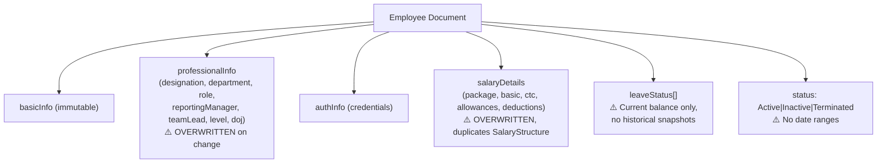

# CTO Enterprise Architecture Audit v2 — Workhub ERP HRMS Platform

> **Audit Date:** 2026-07-21 | **Revision:** v2 — incorporates CTO feedback  
> **Scope:** Full production-readiness assessment across 21 dimensions  
> **Method:** Every conclusion verified by tracing actual implementation. Speculative findings explicitly marked.

> [!NOTE]
> **v2 Corrections applied:**
> - Scoring now separates **Architecture Maturity** from **HR Feature Coverage** from **Enterprise Operational Readiness**
> - "Prototype" → "V1 implementation" throughout
> - Workflow engine language corrected: "currently optimized for sequential approvals" not "incapable"
> - 7 new sections added: Configurability, Multi-Company, Domain Events, Reporting, Data Model, Integration, Observability

---

## TABLE OF CONTENTS

| Part | Section | Status |
|---|---|---|
| 1-5 | System Discovery through Static/Workflow Decision | *Unchanged from v1 — see [original audit](file:///C:/Users/ADMIN/.gemini/antigravity-ide/brain/829f4ff4-6d67-4bb8-a2bb-6d00d3916806/cto_enterprise_audit.md)* |
| 6 | HR Operational Audit | *Unchanged from v1* |
| 6A | Employee Lifecycle Audit | *Unchanged from v1* |
| 6B | Salary Revision Audit | *Unchanged from v1* |
| 6C | Promotion Audit | *Unchanged from v1* |
| 7 | Scheduler Audit | *Unchanged from v1* |
| 8 | Email Platform Audit | *Unchanged from v1* |
| 9 | State Machine Audit | *Unchanged from v1* |
| 10 | Security & Authorization Audit | *Unchanged from v1* |
| 11 | Risk Analysis | *Unchanged from v1 — recategorized below* |
| **12** | **HR Configurability Audit** | **🆕 NEW** |
| **13** | **Multi-Company / Tenant Readiness** | **🆕 NEW** |
| **14** | **Domain Events Audit** | **🆕 NEW** |
| **15** | **Reporting & Historical Query Audit** | **🆕 NEW** |
| **16** | **Data Model Design Audit** | **🆕 NEW** |
| **17** | **Integration Audit** | **🆕 NEW** |
| **18** | **Observability & Recoverability Audit** | **🆕 NEW** |
| **19** | **Platform Readiness (Part 15)** | **🆕 NEW** |
| **20** | **Revised Gap Analysis** | **Updated** |
| **21** | **Revised CTO Verdict** | **Updated** |

---

## PART 12 — HR CONFIGURABILITY AUDIT

> Enterprise HRMS isn't just models and services. It's **configuration**. Can the system be adapted without code changes?

### 12.1 Configuration Surface — What Exists

| Configuration Area | Model/Location | Configurable By | Scope | Evidence |
|---|---|---|---|---|
| **Leave Policy** | [LeavePolicy.js](file:///e:/Loigmax/trackerV1/Backend/src/models/LeavePolicy.js) | Admin UI | Per Department + Designation + Employee override | ✅ 4-level resolution: Employee Override → Dept+Desig Combo → Dept → Desig. Verified in [PolicyTransitionCron.js L54-133](file:///e:/Loigmax/trackerV1/Backend/src/cron/PolicyTransitionCron.js#L54-L133) |
| **Attendance Policy** | [AttendancePolicy.js](file:///e:/Loigmax/trackerV1/Backend/src/models/AttendancePolicy.js) | Admin UI | Per Department (via Department.attendancePolicy ref) | ✅ Configurable grace minutes, late mark threshold, half day hours, weekly off rules, sandwich rule, LOP rules |
| **Holiday Calendar** | [Holiday.js](file:///e:/Loigmax/trackerV1/Backend/src/models/Holiday.js) | Admin UI | Per Year + Type (national/regional/optional/company) + State | ✅ `applicableStates` supports regional differentiation |
| **Shift Management** | [Shift.js](file:///e:/Loigmax/trackerV1/Backend/src/models/Shift.js) | Admin UI | Per Shift + Employee assignment | ✅ ShiftAssignment with start/end dates, weekly off per shift |
| **Payroll Statutory** | [GeneralSettings.payroll](file:///e:/Loigmax/trackerV1/Backend/src/models/GeneralSettings.js#L97-L103) | Admin UI | Global | ✅ PF ceiling/percent, ESI threshold/percent configurable |
| **Salary Components** | [SalaryStructure.js](file:///e:/Loigmax/trackerV1/Backend/src/models/SalaryStructure.js) | Admin UI | Per Employee | ✅ Dynamic earnings/deductions arrays with formula support |
| **Notification Rules** | [NotificationRule.js](file:///e:/Loigmax/trackerV1/Backend/src/models/NotificationRule.js) | Admin UI | Per Model + Trigger | ✅ Condition groups with AND/OR logic, custom resolvers, field-based recipients, template system |
| **Workflow (Approval)** | [Workflow.js](file:///e:/Loigmax/trackerV1/Backend/src/models/Workflow.js) | Admin UI | Per Model + Department | ✅ Multi-step approval with actor types |
| **Status Config** | [StatusConfig.js](file:///e:/Loigmax/trackerV1/Backend/src/models/StatusConfig.js) | Admin UI | Per Model | ✅ Meta statuses + workflow statuses with color, order, terminal/sequential flags |
| **HR Policies** | [HRPolicy.js](file:///e:/Loigmax/trackerV1/Backend/src/models/HRPolicy.js) | Admin UI | Per Category + Department + Role | ✅ Versioned, with effective dates, acknowledgment tracking, applicability scoping |
| **Financial Year** | [GeneralSettings.finance](file:///e:/Loigmax/trackerV1/Backend/src/models/GeneralSettings.js#L109-L124) | Admin UI | Global | ✅ Configurable FY start month (April/January/July) |
| **Period Closure** | [PeriodClosure.js](file:///e:/Loigmax/trackerV1/Backend/src/models/PeriodClosure.js) | Admin UI | Per Module (Payroll/Attendance/Expenses/TimeTracking/Quotations) | ✅ Granular module-level closure with overlap prevention |
| **Cron Schedules** | [GeneralSettings.cron](file:///e:/Loigmax/trackerV1/Backend/src/models/GeneralSettings.js#L136-L141) | Admin UI | Per Job | ✅ jobName, enabled flag, cronExpression, timezone — all configurable |
| **Expense Limits** | [GeneralSettings.finance](file:///e:/Loigmax/trackerV1/Backend/src/models/GeneralSettings.js#L115-L124) | Admin UI | Global + Per Category | ✅ Daily limit + category limits (travel/accommodation/food/misc) |
| **Storage Provider** | [GeneralSettings.storage](file:///e:/Loigmax/trackerV1/Backend/src/models/GeneralSettings.js#L132-L134) | Admin UI | Global | ✅ Supports local/s3/r2/azure/gcs/minio |
| **Timezone** | [GeneralSettings.localization](file:///e:/Loigmax/trackerV1/Backend/src/models/GeneralSettings.js#L16-L20) | Admin UI | Global (single timezone) | ⚠️ One timezone for entire org — no per-employee timezone |

### 12.2 Configuration Surface — What's Missing

| Configuration Area | Status | Impact |
|---|---|---|
| **Onboarding templates per department** | ❌ Missing | All employees get the same hardcoded checklist or require a `Workflow` record manually created in DB |
| **Onboarding templates per role/designation** | ❌ Missing | Cannot differentiate engineering vs. sales vs. HR onboarding |
| **Onboarding templates per employment type** | ❌ Missing | Full-time, contract, intern receive identical checklists |
| **Onboarding templates per legal entity** | ❌ Missing | No legal entity concept exists |
| **Offer letter templates** | ❌ Missing | Hardcoded in [pdfService.js L89-180](file:///e:/Loigmax/trackerV1/Backend/src/services/pdfService.js#L89-L180) — company name "Tracker Workhub ERP" literal |
| **Document templates** | ❌ Missing | No template system for appointment letters, increment letters, experience letters |
| **Email templates** | ❌ Missing | Inline HTML string in service hook |
| **Notice period policies** | ❌ Missing | No model/config for notice period rules |
| **Probation policies** | ❌ Missing | `probationPeriod` is a free-text string on Employee |
| **Grade/Band definitions** | ❌ Missing | No grade/band master data model |
| **Compensation bands** | ❌ Missing | No salary band/range configuration |
| **Approval delegation** | ❌ Missing | No delegation mechanism (out-of-office approval routing) |
| **Joining policies** | ❌ Missing | No configurable joining day rules |
| **Asset provisioning policies** | ❌ Missing | No asset checklist per role/designation |
| **Country-specific compliance** | ❌ Missing | India-specific only (PF/ESI/PAN/Aadhar). No multi-country tax rules |

### 12.3 Configurability Assessment

**Strengths:** The platform has a *substantial* configuration surface for attendance, leave, shifts, notifications, payroll statutory, and workflows. The LeavePolicy resolution cascade (Employee Override → Dept+Desig → Dept → Desig) with automatic policy transition via [PolicyTransitionCron.js](file:///e:/Loigmax/trackerV1/Backend/src/cron/PolicyTransitionCron.js) is enterprise-grade.

**Gap:** Configurability stops at the boundary of the modules that exist. Onboarding, offers, promotions, transfers — the modules that are missing — naturally have no configuration. The gap is **implementation gap**, not architectural flaw.

**Score: 6/10** — Strong for existing modules, zero for missing modules.

---

## PART 13 — MULTI-COMPANY / TENANT READINESS

### 13.1 Tenant Isolation — Current State

| Aspect | Implementation | Evidence |
|---|---|---|
| **Tenant field on models** | ❌ **Not present** | No `tenantId` or `companyId` field on any model (Employee, Candidate, Onboarding, etc.) |
| **Middleware tenant injection** | ⚠️ **Scaffolded, not enforced** | [authorize.js L93-101](file:///e:/Loigmax/trackerV1/Backend/src/middlewares/authorize.js#L93-L101): `req.tenantId = tenantId` injected from JWT but comments say "In the future, verify user's tenantId matches" |
| **Query scoping** | ❌ **Not implemented** | Generic CRUD (`populateHelper`) does not filter by tenantId |
| **Data isolation** | ❌ **Not implemented** | All companies share the same collections with no isolation |
| **Configuration isolation** | ❌ **Not implemented** | Single `GeneralSettings` document — one timezone, one PF rate, one FY config for entire deployment |
| **NotificationRule per tenant** | ⚠️ **Has `company` field** | [NotificationRule.js L6](file:///e:/Loigmax/trackerV1/Backend/src/models/NotificationRule.js#L6): `company: { type: String, default: "Work Hub ERP" }` — exists but defaulted and not enforced |

### 13.2 Can Company A Have Different Configuration From Company B?

| Configuration | Per-Tenant? | Evidence |
|---|---|---|
| Onboarding checklist | ❌ No | Hardcoded fallback; Workflow lookup has no tenant filter |
| Salary structures | ❌ No | SalaryStructure has no tenantId |
| Holidays | ❌ No | Holiday calendar is global (applicableStates exists but no company) |
| Workflows | ❌ No | Workflow model has no tenantId |
| Email templates | ❌ No | Inline in service; single EmailConfig |
| Approval hierarchy | ❌ No | Workflow resolved by modelName + department only |
| Notification rules | ⚠️ Partially | `company` field exists but not enforced in queries |
| Leave policies | ❌ No | LeavePolicy scoped by department/designation, not tenant |
| Attendance policies | ❌ No | AttendancePolicy linked to department, not tenant |

### 13.3 Multi-Tenant Readiness Score

**Architecture posture:** The middleware has tenant context injection scaffolded. The generic CRUD engine (`populateHelper`) could be extended to auto-scope queries by tenantId with minimal changes. The *architectural path* exists but zero enforcement is built.

**Score: 2/10** — Scaffolding exists, enforcement does not.

---

## PART 14 — DOMAIN EVENTS AUDIT

### 14.1 Domain Event Infrastructure

**Verified: A domain event system EXISTS and is architecturally sound.**

| Component | Implementation | Evidence |
|---|---|---|
| **Event Bus** | [domainEventService.js](file:///e:/Loigmax/trackerV1/Backend/src/services/domainEventService.js) | Bull/Redis queue (`domain-events`) with 5 retry attempts, exponential backoff |
| **Idempotency** | ✅ Redis-backed with in-memory fallback | [domainEventService.js L38-57](file:///e:/Loigmax/trackerV1/Backend/src/services/domainEventService.js#L38-L57): `checkAndMarkProcessed()` with 24h TTL |
| **Event types** | `create`, `update`, `delete`, `transition` | [domainEventService.js L66](file:///e:/Loigmax/trackerV1/Backend/src/services/domainEventService.js#L66) |
| **Event payload** | eventId, eventType, modelName, modelId, actorId, beforeSnapshot, timestamp | Complete event envelope |
| **Processor** | → [dynamicNotificationDispatcher.js](file:///e:/Loigmax/trackerV1/Backend/src/services/dynamicNotificationDispatcher.js) | Evaluates NotificationRules against event, resolves recipients, dispatches |
| **Emit points** | Generic CRUD only | [buildCreateQuery.js L116](file:///e:/Loigmax/trackerV1/Backend/src/crud/buildCreateQuery.js#L116), [buildUpdateQuery.js L159](file:///e:/Loigmax/trackerV1/Backend/src/crud/buildUpdateQuery.js#L159) |

### 14.2 Event Coverage Assessment

| Business Event | Emitted? | Consumed? | Effect |
|---|---|---|---|
| **Document created** (generic) | ✅ via buildCreateQuery | ✅ dynamicNotificationDispatcher | Notification rules evaluated |
| **Document updated** (generic) | ✅ via buildUpdateQuery | ✅ dynamicNotificationDispatcher | Notification rules evaluated |
| **EmployeeHired** | ❌ **Not emitted as named event** | ❌ | Inline in candidates.js afterUpdate — never reaches event bus |
| **OfferGenerated** | ❌ **Not emitted** | ❌ | Inline PDF + email — fire-and-forget |
| **OfferAccepted** | ❌ **No such concept** | ❌ | No offer acceptance stage exists |
| **OnboardingStarted** | ❌ **Not emitted** | ❌ | Created inline, never emits |
| **OnboardingCompleted** | ❌ **Not emitted** | ❌ | Status auto-set in afterUpdate — no event |
| **PromotionApproved** | ❌ **No module** | ❌ | — |
| **SalaryRevised** | ⚠️ Generic update event | ⚠️ Via notification rules if configured | No salary-specific event |
| **TransferCompleted** | ❌ **No module** | ❌ | — |
| **ProbationConfirmed** | ❌ **No module** | ❌ | — |
| **EmployeeExited** | ⚠️ Generic update (status → Terminated) | ⚠️ Via notification rules if configured | No exit-specific cascading |
| **LeaveApproved** | ⚠️ Via ApprovalEngine | ✅ Via NotificationDispatcher | Approval notification sent |
| **PayrollProcessed** | ⚠️ Generic update event | ⚠️ If rules configured | No payroll-specific event |
| **AttendanceMarked** | ✅ Via generic create | ⚠️ If rules configured | — |

### 14.3 Domain Events Assessment

**Strengths:** The event infrastructure is well-designed — Bull queue with idempotency, retry, exponential backoff, and pluggable notification rule evaluation. This is **better than most enterprise HRMS systems** at the infrastructure level.

**Gap:** Events are emitted only from generic CRUD operations. Service hook logic (Hire flow, Offer generation, Onboarding completion) bypasses the event bus entirely. Named business events (`EmployeeHired`, `PromotionApproved`) do not exist — everything is `create`/`update`/`delete` on a model name.

**Classification:** This is an **implementation gap**, not an architectural gap. The bus exists; it needs named business events routed through it.

**Score: 5/10** — Infrastructure is 9/10, coverage is 2/10.

---

## PART 15 — REPORTING & HISTORICAL QUERY AUDIT

### 15.1 Can These Enterprise Reports Be Generated?

| Report | Possible? | How | Limitations |
|---|---|---|---|
| **Current headcount by department** | ✅ | `Employee.aggregate()` on `professionalInfo.department` where status = Active | Live query, accurate |
| **Historical headcount on a past date** | ❌ **Not possible** | Employee has no `effectiveFrom` dates on professionalInfo fields. No EmployeeHistory model. Only `createdAt` and `doj` exist. | Cannot reconstruct org on a past date |
| **Designation history for an employee** | ❌ **Not possible** | `professionalInfo.designation` is overwritten on change. Generic AuditLog captures before/after but is unstructured (Object type). | Would require parsing unstructured AuditLog documents |
| **Salary history** | ✅ | Via [SalaryStructure](file:///e:/Loigmax/trackerV1/Backend/src/models/SalaryStructure.js) versioning | Versioned with effectiveFrom/To — accurate history |
| **Salary history per month** | ✅ | SalaryStructure effectiveFrom + Payroll records per month | Combine SalaryStructure + Payroll |
| **Reporting hierarchy on a past date** | ❌ **Not possible** | `professionalInfo.reportingManager` overwritten on change | — |
| **Department change history** | ❌ **Not possible** | Same as above — overwritten field | — |
| **Leave balance on a past date** | ⚠️ **Partially** | `leaveStatus` on Employee is current-state only. Leave records have dates but balance reconstruction requires computation | Computationally possible but no built-in support |
| **Attendance summary for a period** | ✅ | Attendance records have date + employee fields | Supported via [computationService.js attendance-summary](file:///e:/Loigmax/trackerV1/Backend/src/services/computationService.js#L25-L29) |
| **Payroll register for a month** | ✅ | PayrollRun + Payroll records per month | Supported |
| **Onboarding pipeline report** | ⚠️ **Basic** | Onboarding has status + completionPercent | No SLA tracking, no bottleneck analysis |
| **Recruitment pipeline report** | ✅ | Candidate.stageHistory with timestamps | `stageHistory` array on Candidate model |
| **Attrition report** | ⚠️ **Basic** | Count Employee status = Terminated | No exit reason, no exit date field beyond status change timestamp |
| **Cost-to-company analysis** | ⚠️ **Partially** | SalaryStructure has CTC | No benefits, no variable pay, no employer contributions beyond PF/ESI |

### 15.2 Export Capabilities

| Capability | Status | Evidence |
|---|---|---|
| **Task CSV export** | ✅ | [exportRoutes.js](file:///e:/Loigmax/trackerV1/Backend/src/routes/exportRoutes.js) — GET `/api/export/tasks` |
| **OA PDF export** | ✅ | [exportRoutes.js L47-80](file:///e:/Loigmax/trackerV1/Backend/src/routes/exportRoutes.js#L47-L80) |
| **Employee CSV export** | ❌ Missing | No employee export |
| **Payroll CSV export** | ❌ Missing | No payroll export |
| **Attendance CSV export** | ❌ Missing | No attendance export |
| **Bulk import** | ❌ Missing | No import capability for any model |
| **API extensibility** | ✅ | Generic CRUD supports field projection, filtering, pagination |

### 15.3 Reporting Score

**Score: 3/10** — Current-state queries work well. Historical/point-in-time reporting is impossible for most HR dimensions because the Employee model overwrites state in place.

---

## PART 16 — DATA MODEL DESIGN AUDIT

### 16.1 Employee Model — Architectural Concerns

The [Employee.js](file:///e:/Loigmax/trackerV1/Backend/src/models/Employee.js) model stores everything as **current state**, with fields directly overwritten:

### 16.2 Fields That Should Be Event-Sourced vs. Directly Stored

| Field | Current Storage | Enterprise Pattern | Risk |
|---|---|---|---|
| `designation` | Direct on Employee | Should be EmployeeDesignationHistory with effectiveFrom/To | History lost. Cannot answer "What was X's designation on Jan 1?" |
| `department` | Direct on Employee | Should be EmployeeDepartmentHistory with effectiveFrom/To | History lost. Leave/attendance policy cascades are one-shot |
| `reportingManager` | Direct on Employee | Should be EmployeeManagerHistory with effectiveFrom/To | History lost. Cannot reconstruct past org charts |
| `role` | Direct on Employee | Should be EmployeeRoleHistory with effectiveFrom/To | Access policy changes untracked |
| `level` | Direct on Employee | Should be EmployeeGradeHistory with effectiveFrom/To | Career progression untracked |
| `salaryDetails` | Direct on Employee | **Should be removed** — SalaryStructure is the versioned source of truth | Dual source of truth. Data divergence risk. |
| `leaveStatus[]` | Current balance on Employee | Acceptable for performance, but needs periodic snapshots | Cannot audit past leave balance disputes |
| `status` | Direct on Employee | Needs effectiveFrom with history | Cannot reconstruct past headcount |

### 16.3 Models That Should Exist But Don't

| Model | Purpose | Impact of Absence |
|---|---|---|
| **EmployeeLifecycleEvent** | Immutable log of every professional info change with effectiveDate, previousValue, newValue, approvedBy | No auditable history for any HR change |
| **Promotion** | Business event linking designation change + salary change + approval | Promotions are invisible field mutations |
| **Transfer** | Business event linking department change + manager change + approval | Transfers are invisible field mutations |
| **Confirmation** | Probation end event with assessment, approval | No confirmation workflow |
| **Offboarding** | Exit checklist, asset return, access revocation, final settlement | No structured exit process |
| **Separation** | Resignation/termination with notice period, last working day, exit interview | `status = Terminated` is the only exit signal |
| **OnboardingTemplate** | Department/role-specific checklist configuration | Hardcoded or requires manual Workflow DB entry |
| **Grade / Band** | Organizational grade/band master data | No career framework structure |
| **CompensationBand** | Salary range per grade/designation | No hiring/revision guardrails |

### 16.4 Data Model Score

**Score: 5/10** — The existing models are well-structured with proper indexing, validation, and referential integrity. The Employee model is clean and not over-engineered. But it is designed for **current-state CRUD**, not **event-sourced lifecycle management**. This is an architectural decision that limits historical reporting and auditing.

---

## PART 17 — INTEGRATION AUDIT

### 17.1 External System Integrations

| Integration | Status | Evidence |
|---|---|---|
| **Google SSO** | ✅ Implemented | [AuthController.js L148-261](file:///e:/Loigmax/trackerV1/Backend/src/Controller/AuthController.js#L148-L261) — OAuth2Client, Google ID token verification, `authMethod: "google"` on session |
| **Firebase Cloud Messaging** | ✅ Implemented | [fcmService.js](file:///e:/Loigmax/trackerV1/Backend/src/services/fcmService.js) — AES-256 encrypted service account key in GeneralSettings, retry with JobQueue, transient vs. permanent error classification |
| **SMTP Email** | ✅ Implemented (inline) | [candidates.js L140-166](file:///e:/Loigmax/trackerV1/Backend/src/services/candidates.js#L140-L166) — nodemailer with dynamic EmailConfig |
| **Cloud Storage** | ✅ Configurable | GeneralSettings.storage supports `local/s3/r2/azure/gcs/minio` |
| **Redis** | ✅ Production use | Cache, queues, idempotency, domain events |
| **MongoDB** | ✅ Production use | Primary datastore with compression, indexing, connection pooling |
| **Microsoft 365** | ❌ Missing | No Outlook/Teams/Azure AD integration |
| **Google Workspace** | ❌ Missing | SSO exists but no Google Calendar, Drive, or Admin provisioning |
| **Slack** | ❌ Missing | No Slack notification channel |
| **SAML/OIDC SSO** | ❌ Missing | Only Google OAuth — no generic SAML/OIDC for enterprise IdP (Okta, Azure AD) |
| **Asset Management** | ⚠️ Internal only | AssetAllocation model exists but no external ITAM integration |
| **Payroll Bank Files** | ❌ Missing | No bank file generation (NEFT/RTGS/IMPS batch formats) |
| **Statutory Filing** | ❌ Missing | No PF/ESI/TDS return generation |
| **Background Verification** | ❌ Missing | No BGV vendor integration |
| **Biometric Attendance** | ❌ Missing | Punch-based but no hardware integration API |
| **VPN / Badge Access** | ❌ Missing | No access provisioning integration |

### 17.2 Integration Score

**Score: 4/10** — Strong on Google SSO + FCM + multi-cloud storage. But missing enterprise identity (SAML/OIDC), productivity suite provisioning, and statutory compliance integrations.

---

## PART 18 — OBSERVABILITY & RECOVERABILITY AUDIT

### 18.1 Can Operations Staff See and Fix Problems?

| Capability | Status | Evidence |
|---|---|---|
| **Failed job visibility** | ⚠️ Partial | Bull queues retain failed jobs (`removeOnFail: 50` in domainEventService). But no admin UI to view them |
| **Retry failed onboarding** | ❌ Not possible | No retry mechanism for service hook failures |
| **Email failure visibility** | ❌ Not possible | `console.error` only — no persistent failure log, no admin UI |
| **Email replay** | ❌ Not possible | Fire-and-forget; no message ID stored |
| **Workflow failure visibility** | ❌ Not possible | ApprovalEngine throws errors that propagate to API response — no failure queue |
| **Workflow replay** | ❌ Not possible | No dead letter queue for failed workflow steps |
| **Scheduled job failure visibility** | ⚠️ Partial | AttendanceCron has [CronMonitor](file:///e:/Loigmax/trackerV1/Backend/src/cron/AttendanceCron.js#L5-L67) with stats (lastRun, duration, errors, 30-run average). Other crons have only console.error |
| **Onboarding resume** | ❌ Not possible | If Employee created but Onboarding fails, no resume path |
| **Queue health dashboard** | ⚠️ Partial | Queue stats via `getQueueStats()` on attendanceService. But no centralized queue health endpoint |
| **Race condition handling** | ✅ Implemented | [raceConditionHandler.js](file:///e:/Loigmax/trackerV1/Backend/src/services/raceConditionHandler.js) — optimistic locking with version field, distributed locks (scaffolded), retry with exponential backoff |
| **Audit trail** | ✅ | [AuditLog.js](file:///e:/Loigmax/trackerV1/Backend/src/models/AuditLog.js) — model, docId, action, userId, role, before, after, metadata. Compound indexes for efficient audit queries |
| **Audit trail completeness** | ⚠️ Partial | Generic CRUD (buildUpdateQuery, buildDeleteQuery) logs audits. But service hook operations (Employee create during Hire, Onboarding create) bypass generic CRUD audit |
| **Performance monitoring** | ⚠️ Partial | CronMonitor tracks run duration. But no APM, no request latency tracking, no slow query logging |
| **Memory monitoring** | ✅ | [AttendanceCron cleanup](file:///e:/Loigmax/trackerV1/Backend/src/cron/AttendanceCron.js#L128-L142) — explicit GC with heap usage logging |
| **Error alerting** | ❌ Missing | All errors go to `console.error` — no Slack/email/PagerDuty alerting |

### 18.2 Retry Infrastructure

| Component | Retry? | Evidence |
|---|---|---|
| Domain event queue | ✅ 5 attempts, exponential backoff | [domainEventService.js L81-87](file:///e:/Loigmax/trackerV1/Backend/src/services/domainEventService.js#L81-L87) |
| FCM push queue | ✅ 3 attempts via JobQueue | [fcmService.js L66-67](file:///e:/Loigmax/trackerV1/Backend/src/services/fcmService.js#L66-L67) |
| Attendance queue | ✅ 3 attempts | [attendanceService.js L11-12](file:///e:/Loigmax/trackerV1/Backend/src/services/attendanceService.js#L11-L12) |
| Payroll compute queue | ✅ Via computationService | Bull queue with retry |
| Race condition handler | ✅ 3 retries, exponential backoff | [raceConditionHandler.js L16-17](file:///e:/Loigmax/trackerV1/Backend/src/services/raceConditionHandler.js#L16-L17) |
| Email delivery | ❌ No retry | Fire-and-forget in candidates.js |
| Hire flow (multi-doc) | ❌ No retry, no compensation | No rollback, no resume |
| Onboarding creation | ❌ No retry | — |
| Approval workflow | ❌ No retry | Errors propagate to HTTP response |

### 18.3 Observability Score

**Score: 4/10** — Good retry infrastructure on queue-based operations. CronMonitor for attendance is well-designed. But zero admin-facing dashboards, no alerting, no failure replay, no dead letter queues for business operations.

---

## PART 19 — PLATFORM READINESS

> Can the HRMS become a multi-tenant SaaS platform? Can future modules be added without architectural redesign?

### 19.1 Platform Extension Assessment

| Capability | Status | Evidence |
|---|---|---|
| **Adding a new CRUD module** | ✅ Excellent | Create Model + register in Collection.js + (optional) Service Hook. Zero boilerplate routes/controllers needed. |
| **Adding new workflow-enabled module** | ✅ Good | Workflow model supports new modelNames. ApprovalEngine/EscalationEngine resolve per-model. |
| **Adding new notification triggers** | ✅ Good | NotificationRule supports any modelName + trigger type. DynamicNotificationDispatcher evaluates rules generically. |
| **Adding new policies** | ✅ Good | Follow LeavePolicy/AttendancePolicy pattern — model + Department ref + PolicyTransitionCron pattern. |
| **Configuration management** | ✅ Good | GeneralSettings singleton pattern. New sections added without migration. |
| **Feature flags** | ❌ Missing | No feature flag system. `useDynamicNotifications` in GeneralSettings is the closest — a single boolean toggle. |
| **Tenant isolation** | ❌ Missing | Scaffolded but not enforced. Would require adding tenantId to every model + query scoping in populateHelper. Feasible but significant. |
| **Localization / i18n** | ❌ Missing | No translation system. UI strings hardcoded in English. |
| **Country-specific compliance** | ❌ Missing | India-only (PF/ESI/PAN/Aadhar). No pluggable tax/statutory module. |
| **Audit history** | ✅ Exists | Generic AuditLog with before/after snapshots. |
| **Historical reporting** | ❌ Missing | No point-in-time reconstruction capability (see Part 15). |
| **Data migration tools** | ❌ Missing | No import/migration scripts for employee data. |
| **Import / Export** | ⚠️ Partial | Task CSV export only. No employee, payroll, attendance export. No import. |
| **API extensibility** | ✅ Good | Generic CRUD with projection, filtering, pagination, population. Custom routes for specialized operations. |
| **Plugin architecture** | ❌ Missing | No plugin/module registration system. |

### 19.2 Architecture Extension Cost Matrix

| New Module | Effort | Reason |
|---|---|---|
| Promotion (new model + service) | 2-3 weeks | Follows existing pattern. Needs lifecycle event + approval workflow + cascading. |
| Transfer (new model + service) | 2-3 weeks | Same pattern. Dual-department approval is new. |
| Offboarding (new model + service) | 2-3 weeks | Follows onboarding checklist pattern with asset return + access revocation. |
| Multi-tenant enforcement | 4-6 weeks | Add tenantId to every model, scope populateHelper, migrate data. Medium-risk refactor. |
| Feature flags | 1 week | Extend GeneralSettings with feature map + middleware check. |
| Historical reporting | 4-6 weeks | Requires EmployeeLifecycleEvent model + migration of existing data from AuditLogs. |
| Country-specific compliance | 6-8 weeks | Pluggable tax/statutory module. Major new abstraction. |

### 19.3 Platform Readiness Score

**Score: 6/10** — The generic CRUD engine, service hook pattern, workflow model, and notification rule system make adding new modules straightforward. This is a well-designed platform for extension. But multi-tenancy, feature flags, i18n, and plugin architecture would need significant investment.

---

## PART 20 — REVISED GAP ANALYSIS

> [!IMPORTANT]
> **Key correction from v1:** Gaps are now classified as **Implementation Gaps** (features not yet built on a sound architecture) vs. **Architectural Gaps** (structural limitations that require redesign).

### 20.1 Architectural Gaps (require redesign)

| Gap | Impact | Effort | Why It's Architectural |
|---|---|---|---|
| Employee model stores current state only — no lifecycle event history | Cannot produce historical reports, reconstruct past org state, audit changes | 4-6 weeks | Fundamental data model decision. Adding EmployeeLifecycleEvent changes how every Employee update works |
| `Employee.salaryDetails` duplicates `SalaryStructure` | Dual source of truth. Payroll falls back to Employee when no SalaryStructure exists | 1-2 weeks to deprecate | Two competing salary resolution paths in payrollEngine |
| No transaction boundaries for multi-document business operations | Data corruption risk in Hire flow, approval cascades | 1-2 weeks | Requires MongoDB replica set + session-based transaction wrapping throughout service hooks |
| No multi-tenancy enforcement | Cannot deploy as SaaS for multiple companies | 4-6 weeks | Every model + every query needs tenant scoping |
| No named business events | Domain event bus exists but all events are generic CRUD (`create`/`update`/`delete`) | 2-3 weeks | Service hooks bypass event bus; named events need emitting from business operations |

### 20.2 Implementation Gaps (features to build on existing architecture)

| Gap | Impact | Effort | Why It's Implementation |
|---|---|---|---|
| No Promotion module | No auditable promotion workflow | 3-4 weeks | Follows existing model + service + workflow pattern |
| No Transfer module | No transfer tracking | 3-4 weeks | Same |
| No Offboarding module | No structured exit process | 2-3 weeks | Follows onboarding checklist pattern |
| No onboarding scheduler | Stalled onboardings undetected | 1-2 weeks | Add cron following AttendanceCron/EscalationCron pattern |
| Mock email processor | Emails not actually delivered | 1 week | Replace mock with real SMTP in asyncNotificationService |
| 3-state onboarding machine | Insufficient tracking | 1-2 weeks | Expand enum + service hook validation |
| No document upload UI | Documents collected outside system | 1-2 weeks | Frontend component + file route integration |
| No offer acceptance tracking | Gap between Offered → Hired | 1 week | Add Candidate stage |
| Hardcoded onboarding checklist | Cannot customize per dept/role | 1-2 weeks | OnboardingTemplate model |
| No onboarding notifications | HR not informed of progress | 1 week | Add NotificationRule records + emit events |
| No salary revision approval | Unauthorized salary changes possible | 2 weeks | Wire SalaryStructure through ApprovalEngine |
| No bulk salary revision | Annual appraisals one-by-one | 2 weeks | Bulk operation endpoint + queue processing |
| No employee data import/export | Manual data entry only | 1-2 weeks | CSV parser + validation + bulk create |
| No email templates | Inline HTML strings | 1-2 weeks | Template model + Handlebars rendering |
| No error alerting | Failures go to console.error only | 1 week | Webhook to Slack/email on queue failure |
| No admin queue dashboard | Operations cannot see failed jobs | 1-2 weeks | Bull Board or custom endpoint |

---

## PART 21 — REVISED CTO VERDICT

### Corrected Scoring Model

> [!IMPORTANT]
> The original audit conflated architecture quality with feature completeness, producing an Overall score of 3/10 that misrepresents the engineering quality of the platform.

| Dimension | Score | Justification |
|---|---|---|
| **Architecture Maturity** | **7.5/10** | Generic CRUD engine with ABAC, service hooks pattern, domain event bus with idempotency + retry, Bull/Redis queues for computation + notifications, approval/escalation workflow engine, race condition handler, configurable cron system, multi-provider storage, audit logging. This is a **well-architected platform**. |
| **HR Feature Coverage** | **3.5/10** | Recruitment → Offer → Hire → V1 Onboarding → Leave → Attendance → Payroll exist. Promotion, Transfer, Confirmation, Offboarding, Probation automation, Grade/Band, Historical lifecycle — do not exist. |
| **HR Configurability** | **6/10** | Strong for existing modules (leave policy cascade, attendance policy, holiday calendar, shift management, notification rules, status config, period closure). Zero for missing modules. |
| **Enterprise Operational Readiness** | **5/10** | Payroll engine is production-grade. Queue infrastructure is solid. Cron monitoring exists for attendance. But no HR operational dashboards, no failure recovery, no bulk operations, mock email, no alerting. |
| **Data Model Design** | **5/10** | Clean schemas, proper indexing, validation. But current-state-only Employee model prevents historical reporting. Dual salary storage creates confusion. |
| **Domain Event Architecture** | **5/10** | Infrastructure is 9/10 (Bull + Redis + idempotency + retry). Coverage is 2/10 (only generic CRUD events reach the bus). |
| **Multi-Tenant Readiness** | **2/10** | Scaffolded (tenantId injection in middleware) but zero enforcement. |
| **Integration Surface** | **4/10** | Google SSO + FCM + multi-cloud storage. Missing SAML/OIDC, workspace provisioning, statutory compliance. |
| **Observability** | **4/10** | Good retry on queues. CronMonitor for attendance. But no admin dashboards, no alerting, no failure replay. |
| **Platform Extensibility** | **7/10** | New modules can be added with minimal boilerplate. Generic CRUD + service hooks + workflow model = strong extension pattern. |
| | | |
| **Overall** | **6/10** | The platform has **strong engineering foundations** that are well above average. The gap is **feature coverage**, not engineering quality. A system with this architecture can reach enterprise readiness through systematic feature implementation — it does not need an architectural rewrite. |

### Key Classification: What's Wrong vs. What's Missing

| Category | Items |
|---|---|
| **Architecturally wrong** (needs redesign) | Employee current-state-only model; dual salary storage; no transaction boundaries; mock email in production path; tenant enforcement absent |
| **Not built yet** (implementation work on sound foundation) | Promotion, Transfer, Offboarding, Confirmation modules; onboarding scheduler; named business events; document upload UI; email templates; bulk operations; admin dashboards |
| **Deliberate V1 scope** (acceptable for current scale) | 3-state onboarding (sufficient for <500 employees); single-timezone (sufficient for single-country); hardcoded offer letter (sufficient for single company); task-only CSV export |

### Onboarding Assessment — Corrected

The original audit called onboarding a "prototype." That was inaccurate.

**Corrected assessment:** Onboarding is a **V1 implementation** — it handles the core flow (Hire → Employee creation → Checklist → Completion) correctly and completely. What it lacks is **enterprise depth** (document verification, SLA tracking, scheduling, notifications, cancellation). The architecture supports adding these without redesign.

### Workflow Engine Assessment — Corrected

The original audit stated the workflow engine "cannot support onboarding." More accurately:

**Corrected assessment:** The workflow engine is **currently optimized for sequential approval flows**. Its step model (actorType, actions, conditions) is designed for linear progression. Supporting onboarding's parallel task orchestration would require adding parallel step support, which is a **significant but feasible extension** of the existing engine — not a fundamental limitation.

### Top 5 Priority Actions

| Priority | Action | Classification | Estimated Effort |
|---|---|---|---|
| 1 | **Add MongoDB transactions to Hire flow** | Architectural fix | 1 week |
| 2 | **Replace mock email processor with real SMTP** | Production blocker | 3 days |
| 3 | **Block direct Employee.salaryDetails mutation via ABAC** | Security fix | 2 days |
| 4 | **Create EmployeeLifecycleEvent model** | Architectural investment | 3-4 weeks |
| 5 | **Build onboarding scheduler + notifications** | Feature completion | 2 weeks |

### Final CTO Statement

The platform demonstrates **strong engineering foundations** — the generic CRUD engine, ABAC security model, domain event bus, payroll computation engine, approval/escalation workflow, queue infrastructure, and configuration surface are well-designed and architecturally sound. The HRMS capability is at **V1 maturity** — the recruitment-to-onboarding-to-payroll pipeline works end-to-end. The gap is in **HR feature depth** (lifecycle events, promotions, transfers, offboarding) and **enterprise operational tooling** (observability, bulk operations, historical reporting). The 5 architectural fixes above should be addressed before scaling beyond current deployment. Feature gaps can be closed through systematic implementation on the existing architecture — no rewrite is required.
