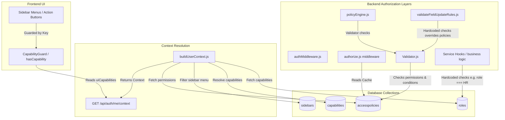
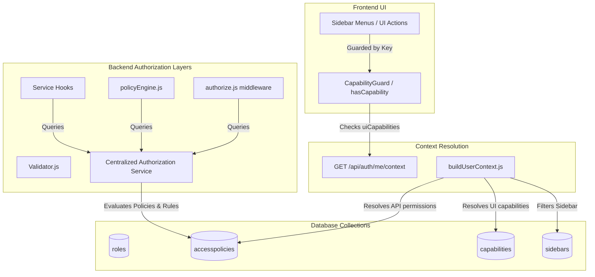

# ERP Authorization & Menu Capability Architecture Audit (Updated)

This document presents a comprehensive audit of the Workhub ERP Tracker authorization system, identifies architectural drift and competing sources of truth, and proposes a phased implementation plan to align the codebase with its original design principles.

---

## Core Guiding Philosophy

> [!IMPORTANT]
> **Capabilities are hints for UX. AccessPolicies are guarantees for security.**
> 
> - **Capabilities** answer: *"What should the user see?"* (UI visibility of links, sections, pages, and buttons).
> - **AccessPolicies** answer: *"What may the user actually do?"* (API endpoints security boundary, dynamic CRUD checks, and field-level permissions).

---

## Redundancy Audit: Do Sidebars Need `resourceId`?

> [!IMPORTANT]
> **Conclusion: `resourceId` on `SideBar` is Obsolete**
> - **The `Resource` registry collection itself** is still necessary to map API resource keys to Mongoose model names (e.g., mapping `leave` to the `leaves` collection in the dynamic `populateHelper` endpoint).
> - **However, the `resourceId` link on the `SideBar` model is NOT necessary.** Since a menu item only governs the visibility of the route link (via capability checks) and does not authorize data access (which is checked at the API layer by `AccessPolicies`), linking sidebars to resources is redundant.
> - **Action Plan:** Deprecate and remove `resourceId` (and deprecated fields `allowedDepartments` and `allowedDesignations`) from the `SideBar` collection.

---

## Conflict Audit: `validateFieldUpdateRules.js` vs. `AccessPolicies`

> [!WARNING]
> **The Security Contradiction:**
> - `AccessPolicies` already has a configuration-driven mechanism for field-level security using `allowAccess` (whitelist) and `forbiddenAccess` (blacklist) per CRUD action.
> - However, `validateFieldUpdateRules.js` was introduced as a hardcoded gate that intercepts all update payloads. Because it hardcodes fields like `authInfo` and `salaryDetails` on the `employees` model, it completely overrides the database policies.
> - **The Result:** Even if a policy configuration explicitly grants a role permission to update `authInfo` (e.g., an Admin updating an employee's email), `validateFieldUpdateRules.js` throws a blocking error, ignoring database configurations.
> - **Resolution:** Delete the hardcoded field-blocking lists from `validateFieldUpdateRules.js` and move these restrictions directly into the database `AccessPolicies` configs. This restores `AccessPolicies` as the single source of truth for field-level security.

---

## Capabilities Classification & Schema Design

Currently, the database has **235 capabilities** mixing several concerns (e.g., `Employee:create` for CRUD, `Leave:approve` for Business Actions, `Settings:menu` for Menu Visibility).

To separate these concerns cleanly, we will introduce a `type` field to the `Capability` model:

### 1. Schema Refinement ([Capability.js](file:///e:/Loigmax/trackerV1/Backend/src/models/Capability.js))
Add the `type` property to categorize capabilities:
```javascript
type: {
  type: String,
  enum: ['ui', 'business'],
  default: 'ui',
  index: true
}
```

### 2. Page & API Filter Mapping

- **Designation Permissions Page (`designation-permissions.jsx`):**
  - **Filter Criteria:** Queries capabilities where `type === 'ui'`.
  - **Purpose:** Manages sidebar menu visibility and standard CRUD button layouts (`view`, `create`, `edit`, `delete` buttons).
  - **Example:**
    ```json
    { "key": "Employee:view", "type": "ui" }
    ```

- **Role Creation & Edit Page:**
  - **Filter Criteria:** Queries capabilities where `type === 'business'`.
  - **Purpose:** Manages domain-specific execution triggers and workflow transitions.
  - **Example:**
    ```json
    { "key": "Leave:approve", "type": "business" }
    ```

---

## Architecture Diagrams

### Current Authorization Flow (With Drift)



### Proposed Authorization Flow (Clean Separation Maintained)



---

## Section 1 – Capability System Audit

### Existing Capabilities
A total of **241 active capabilities** exist in the database (e.g., `Profile:view`, `Attendance:view`, `Employee:create`, `Sidebar:view`, etc.).
- **Purpose:** Restricting UI visibility (menus, buttons, tabs).
- **Used By:** Frontend `PermissionProvider.hasCapability()` and `CapabilityGuard` component.
- **Menus Linked:** All protected sidebar items (e.g., `/master-data/employees` is mapped to `Employee:view` in `pageCapabilityMapping.js`).
- **Actions Linked:** UI buttons (e.g., "+ Add Employee" button is guarded by `Employee:create`).

### Initialization Flow
1. **Startup:** `index.js` starts, connecting to MongoDB and executing `setCache()` in `src/utils/cache.js`. This populates the in-memory policy and role caches.
2. **Capability Registry:** `Capability` documents define available keys. `src/Config/pageCapabilityMapping.js` maps route regexes to capability keys.
3. **Menu Generation:** Mongoose `SideBar` items are fetched. `contextBuilder.js` calls `buildMenuTree(menuItems, user)`, which checks route capability mappings and filters out routes the user lacks.
4. **User Capability Resolution:** On login or polling, `/api/auth/me/context` executes `buildUserContext()`. It checks `Role.capabilities` + `UserOverride` to return `uiCapabilities` to the client.

### Linked Resource Analysis
- **What they are:** Mongoose `Resource` model mapping a business `key` to a database `modelName` (e.g., `leave` -> `leaves`).
- **Why they were introduced:** To decouple database models from business concepts and avoid string drift.
- **Are they necessary?** Yes, but **only at the API controller boundary** (`populateHelper.js`) to parse route keys. They are **not** needed on the `SideBar` documents since menu visibility is handled by UX capability checks and actual data access is protected by backend `AccessPolicies`.
- **How they can be simplified:** Remove `resourceId` from the `SideBar` model. The sidebar item only needs a route and capability key configuration.

---

## Section 2 – Authorization Audit

| Mechanism | Purpose | Source of Truth |
| --- | --- | --- |
| **RBAC** | Assigns user designation level (1-10) and links to Access Policies. | `roles` collection in database. |
| **AccessPolicies** | Governs entity-level CRUD permissions and condition checks. | `accesspolicies` collection in database. |
| **Capabilities** | Controls frontend menu/button visibility. | `capabilities` collection in database, linked via `Role`. |
| **Hardcoded Roles** | Intercepts operations (e.g., cron routes, field validations). | Code files (e.g. `cronRoutes.js`, `validateFieldUpdateRules.js`). |
| **Field Permissions** | Whitelists/blacklists fields per model action. | `accesspolicies` collection (`allowAccess`/`forbiddenAccess`). |

---

## Section 3 – Hardcoded Role Audit

| File | Line | Reason | Replacement | Risk |
| --- | --- | --- | --- | --- |
| [validateFieldUpdateRules.js](file:///e:/Loigmax/trackerV1/Backend/src/utils/validateFieldUpdateRules.js) | 37 | Hardcoded model-level field lock: blocks `authInfo` and `salaryDetails` update on `employees` for all users. | Configure via `forbiddenAccess.update` in `AccessPolicies`. | Low. Need to seed policies. |
| [validateFieldUpdateRules.js](file:///e:/Loigmax/trackerV1/Backend/src/utils/validateFieldUpdateRules.js) | 58 | Hardcoded role check: blocks salary updates if role is not `"hr"` or `"admin"`. | Enforce via `forbiddenAccess` whitelist in policy engine. | Medium. Ensure caches load properly. |
| [computationService.js](file:///e:/Loigmax/trackerV1/Backend/src/services/computationService.js) | 228 | Hardcoded role check: `role !== 'HR'` restricts task stats to current user. | Check `can('read', 'tasks')` with department/hierarchy policy conditions. | Medium. Need policy engine conditions. |
| [computationService.js](file:///e:/Loigmax/trackerV1/Backend/src/services/computationService.js) | 274 | Hardcoded role check: `role === 'HR'` aggregates active employee stats. | Verify permission `can('read', 'employees')`. | Medium. |
| [cronRoutes.js](file:///e:/Loigmax/trackerV1/Backend/src/routes/cronRoutes.js) | 12 | Route-level hardcoded check: `req.user.role !== 'HR'` blocks cron stats. | Use standard route middleware: `authorize('cron', 'read')`. | Low. |
| [cronRoutes.js](file:///e:/Loigmax/trackerV1/Backend/src/routes/cronRoutes.js) | 59 | Route-level hardcoded check: `req.user.role !== 'HR'` blocks cron trigger. | Use standard route middleware: `authorize('cron', 'write')`. | Low. |

---

## Section 4 – Access Policy Audit

`Backend/src/models/AccessPolicies.js` supports:
- **Entity CRUD:** Fully supported (`actions` list mapping to `read`, `create`, `update`, `delete`).
- **Field CRUD:** Fully supported (`allowAccess` and `forbiddenAccess` arrays per action).
- **Conditional Permissions:** Supported (`conditions` map evaluates fields like `isSelf`, `isTeamMember`, `isAssigned`).

> [!WARNING]
> **Why Field-level permissions on Employee Auth Info are broken:**
> While `AccessPolicies` may allow a role to update `authInfo` fields, the validation utility [validateFieldUpdateRules.js](file:///e:/Loigmax/trackerV1/Backend/src/utils/validateFieldUpdateRules.js#L37) executes *after* the policy engine validator. Because `authInfo` is hardcoded in `modelLockedFields.employees`, it throws a blocking exception and rejects the update.

---

## Section 5 – Authorization Flow Audit

### Existing vs. Envisioned Request Execution Flow

#### Current Flow
The current flow contains hardcoded, rigid blocking points (like `validateFieldUpdateRules.js`) that override policy definitions:
```
Request ──> JWT Auth ──> Route Middleware (authorize.js) ──> Controller ──> populateHelper ──> policyEngine.js (buildQuery) ──> Validator.js (Field & Condition checks) ──> Service Hooks ──> validateFieldUpdateRules.js (Hardcoded Gates) ──> DB
```

#### Envisioned Flow
The target architecture removes hardcoded gates and introduces a clean pipeline where workflows and post-commit side effects (notifications) are strictly integrated:
```
Request ──> JWT Auth ──> Route Middleware (authorize.js) ──> Controller ──> populateHelper ──> policyEngine.js (buildQuery) ──> Validator.js (Field & Condition checks) ──> Service Hooks ──> Workflow Engine ──> DB ──> Notification Dispatcher
```

### Key Integrations in Envisioned Flow:
1. **Validator.js (Field & Condition Checks):** Evaluates whitelists and blacklists from `AccessPolicies`. Replaces the hardcoded lists from `validateFieldUpdateRules.js`.
2. **Service Hooks:** Executes model-level lifecycle calculations (e.g. hashing passwords or computing metrics).
3. **Workflow Engine:** Evaluates approval parameters or escalation transitions (e.g. for Leave requests) prior to DB commit.
4. **DB Commit:** Database operation completes.
5. **Notification Dispatcher:** Fires post-commit notifications (FCM push notification, emails, SMS) based on successful changes, keeping side effects separate from database transactions.

---

## Section 6 – Source of Truth Validation

- **Intended Design:** Unilateral separation between frontend visibility (capabilities) and backend auth (RBAC + AccessPolicies).
- **Actual Design:** Dual-layered capability and policy configuration, combined with hardcoded service files checking role literals (`'HR'`). This creates conflict where changing access policies for a role does not grant menu access, or where granting capabilities does not permit backend queries.

---

## Section 7 – Access Denied Investigation

### Tracing Update Employee Auth Info:
1. **Request:** `PUT /api/populate/update/employees/:id` with body `{ authInfo: { workEmail: 'new@company.com' } }`.
2. **Middleware:** Route-level authorization checks `AccessPolicies` for `employees.update` which is allowed.
3. **Policy Engine:** `Validator.js` body validator passes since `authInfo` is not blacklisted in the Access Policy.
4. **CRUD Engine:** `buildUpdateQuery.js` invokes `validateFieldUpdateRules({ body, modelName: "employees", role, userId })`.
5. **Exceptions:** Line 37 of `validateFieldUpdateRules.js` contains `employees: ["employeeId", "authInfo", "salaryDetails"]`. Since the body contains the key `authInfo`, it throws `⛔ Update not allowed on protected field "authInfo"`.
6. **Verdict:** Denied at the hardcoded validation utility layer.

---

## Proposed Changes

We propose refactoring the authorization system to enforce a centralized, policy-driven model.

### 1. Introduce Centralized Authorization Service

#### [NEW] [authService.js](file:///e:/Loigmax/trackerV1/Backend/src/services/authService.js)
Create a centralized authorization service that handles all permission evaluations (`can`, `canUpdateField`, `hasHierarchyAccess`), reading from `AccessPolicies` cache.

### 2. Replace Hardcoded Service and Route Checks

#### [MODIFY] [computationService.js](file:///e:/Loigmax/trackerV1/Backend/src/services/computationService.js)
Replace hardcoded role checks with permission queries.
```javascript
// Before:
if (role !== 'HR') { baseFilter = { assignedTo: userId }; }
// After:
if (!await authService.can(user, 'read', 'all_tasks')) {
  baseFilter = { assignedTo: userId };
}
```

#### [MODIFY] [cronRoutes.js](file:///e:/Loigmax/trackerV1/Backend/src/routes/cronRoutes.js)
Replace route-level checks with middleware configuration.
```javascript
// Before:
if (req.user.role !== 'HR') { return res.status(403).json(...); }
// After:
router.get('/cron/stats', authenticateToken, authorize('cron', 'read'), async (req, res) => { ... });
```

### 3. Move Hardcoded Field Blockage to Policies

#### [MODIFY] [validateFieldUpdateRules.js](file:///e:/Loigmax/trackerV1/Backend/src/utils/validateFieldUpdateRules.js)
Remove hardcoded `authInfo` and `salaryDetails` blocks. Instead, verify these fields against the `AccessPolicies` blacklist/whitelist config dynamically.

### 4. Remove `resourceId` from SideBar Menu Documents

#### [MODIFY] [SideBar.js](file:///e:/Loigmax/trackerV1/Backend/src/models/SideBar.js)
Deprecate the `resourceId`, `allowedDepartments`, and `allowedDesignations` fields. Menu visibility will rely purely on page routing capability mapping.

---

## Phase-wise Implementation Plan

### Phase 1: Verification & Seeding Audit
- Audit the verify scripts registry. Add missing automation scripts under `/scripts/verify/` (`check-status-transitions.js`, `check-indexes.js`, `check-tx-boundaries.js`, `check-abac-fields.js`).
- Seed standard access policies for all roles so that removing hardcoded role blocks does not result in unauthorized access.

### Phase 2: Centralized Authorization Service
- Implement `authService.js` to expose `can(user, action, resource)` and `canUpdateField(user, modelName, field)`.
- Wire `authService` into `policyEngine.js` and custom controllers.

### Phase 3: Replace Route & Controller Hardcoded Rules
- Update [cronRoutes.js](file:///e:/Loigmax/trackerV1/Backend/src/routes/cronRoutes.js) and other routes to use the standard `authorize` middleware rather than manual `req.user.role` string checks.

### Phase 4: Replace Service-level Hardcoded Rules
- Modify [computationService.js](file:///e:/Loigmax/trackerV1/Backend/src/services/computationService.js) and other services to perform check commands against `authService` rather than checking role literals.

### Phase 5: Fix Field-level Protection (Aligning `validateFieldUpdateRules.js` with `AccessPolicies`)
- Remove hardcoded blockages on `authInfo`, `salaryDetails`, etc. from `validateFieldUpdateRules.js`.
- Delegate field-level updates evaluation directly to the `AccessPolicies` `allowAccess` / `forbiddenAccess` arrays.
- Configure default whitelists/blacklists in the seed data for sensitive fields to maintain security.

### Phase 6: Clean Up Obsolete Sidebar Fields
- Remove `resourceId` reference handling from `SideBar.js`, `contextBuilder.js` menu generation, and the frontend menu pages.

### Phase 7: Separation of Permissions Interfaces (Schema-driven)
- **Schema Update:** Modify [Capability.js](file:///e:/Loigmax/trackerV1/Backend/src/models/Capability.js) to add the `type: { type: String, enum: ['ui', 'business'], default: 'ui', index: true }` field.
- **Designation Permissions Page (`designation-permissions.jsx`):** Update the page fetch queries to retrieve only capabilities where `type === 'ui'` (to show menu visibility and CRUD button states).
- **Role Creation Page:** Update the page fetch queries to retrieve only capabilities where `type === 'business'` (to show domain execution checks like leave approval, onboarding).
- **Seeder Script:** Update seeding scripts to assign types to all existing capabilities.
│
│
│
