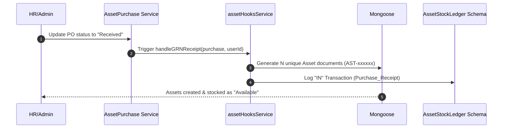
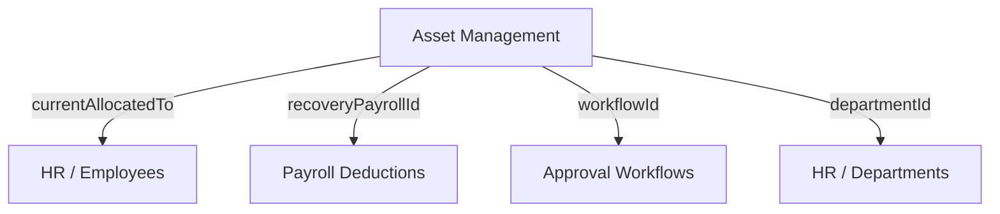

# Assets Module Brain

## Overview
The Assets module handles organizational asset tracking, lifecycle status, employee allocations, damage reporting (incidents), and external repair tracking. It contains 10 models, 9 services, and corresponding frontend view components.

---

## 🏗️ Architecture & Component Relations
The module implements dynamic state transitions for physical assets and integrates them into the central HR ecosystem (for tracking employee possession) and payroll system (for salary recovery of damages).

### Sequence Flow: Goods Receipt Note (GRN) to Asset Creation

---

## 🗄️ Backend Models

| Model | File | Description | Key Fields | Relationships |
| :--- | :--- | :--- | :--- | :--- |
| **Asset** | `Asset.js` | Main asset register tracking lifecycle and condition. | `assetId`, `status`, `condition`, `currentAllocatedTo` | Ref: `assetcategories`, `assetpurchases`, `employees` |
| **AssetAllocation** | `AssetAllocation.js` | Allocation, return, and transfer request logs. | `allocationType`, `status`, `approvals`, `transferFromEmployee` | Ref: `assets`, `employees`, `departments`, `approvalworkflows` |
| **AssetIncident** | `AssetIncident.js` | Loss, theft, or damage tracking; payroll recovery hook. | `incidentType`, `recoveryAmount`, `recoveryApproved`, `status` | Ref: `assets`, `employees`, `departments`, `assetallocations`, `payrolls` |
| **AssetRepair** | `AssetRepair.js` | External repair monitoring with vendor. | `sentDate`, `repairCost`, `repairCondition`, `status` | Ref: `assets`, `assetincidents`, `employees` |
| **AssetCategory** | `AssetCategory.js` | Master index of categories (laptops, phones, etc.). | `name`, `code`, `warrantyMonths`, `isActive` | Ref: `employees` |
| **AssetVendor** | `AssetVendor.js` | Vendors lookup directory. | `name`, `code`, `contactEmail`, `isActive` | |
| **AssetPurchase** | `AssetPurchase.js` | Purchase order tracking (PoNumber, invoice references). | `poNumber`, `totalAmount`, `status` | Ref: `assetvendors`, `employees` |
| **AssetInvoice** | `AssetInvoice.js` | Financial invoices associated with assets. | `invoiceNo`, `amount`, `paymentStatus` | Ref: `assetpurchases` |
| **AssetPayment** | `AssetPayment.js` | Payment transaction records to vendors. | `paymentRef`, `amount`, `paymentMode` | Ref: `assetinvoices` |
| **AssetStockLedger** | `AssetStockLedger.js` | Master inventory audit ledger of state changes. | `transactionType`, `triggerType`, `previousState`, `newState` | Ref: `assets`, `employees` |

### Key Lifecycle Status Transitions (`status` vs `condition`)
- **Asset Status**: `Available` ➔ `Reserved` (Pending allocation) ➔ `Allocated` (Active allocation) ➔ `Under Repair` ➔ `Lost` / `Disposed`.
- **Asset Condition**: `Excellent`, `Good`, `Fair`, `Poor`, `Damaged`.
- *Note*: Condition is reassessed during returns, repair checkouts, and initial registry inputs.

---

## ⚙️ Backend Services (Business Logic Hooks)

### 1. `assetallocations.js`
- **beforeCreate**:
  - Validates target employee exists and is `Active`.
  - Validates asset status is `Available`.
  - Prevents duplicate pending/active allocation requests on the same asset.
  - Enforces transfer rules (current allocation must be `Active`, current owner must match `transferFromEmployee`).
  - Sets default status to `Pending Approval` and createdBy to logged-in user.
- **afterCreate**:
  - Initializes approval workflow (`approvalEngine.initializeWorkflow`).
  - Sets asset status to `Reserved`.
- **beforeUpdate**:
  - Enforces status transition rules (e.g. `Pending Approval` ➔ `Active` or `Rejected`; `Active` ➔ `Returned` or `Transferred`).
  - Triggers asset status and holder updates on approval.
- **afterUpdate**:
  - If status becomes `Active`: Updates [Asset](file:///E:/Loigmax/Tracker/backend/src/models/Asset.js) status to `Allocated` and sets `currentAllocatedTo` and `currentAllocationId`. Writes stock ledger entry (`OUT` - `Allocation_Start`).
  - If status becomes `Returned`: Resets [Asset](file:///E:/Loigmax/Tracker/backend/src/models/Asset.js) status to `Available` and clears allocation properties. Writes stock ledger entry (`IN` - `Allocation_Return`).
  - If status becomes `Transferred`: Creates a new `Active` allocation record for the new employee, updates the Asset's current holder, and logs `TRANSFER` in the stock ledger.

### 2. `assetHooksService.js`
- `writeLedgerEntry`: Logs atomic inventory transactions.
- `handleGRNReceipt`: Fired when `AssetPurchase` becomes `Received`. Generates unique asset records sequentially (AST-xxxxxx) and writes `IN` (Purchase_Receipt) ledger items.

### 3. `assetrepairs.js`
- **beforeCreate**: Validates asset and updates status to `Under Repair` on the asset master.
- **afterUpdate**: If status transitions to `Repaired`, returns asset status to `Available` and reassesses physical condition. If status transitions to `Beyond Repair`, updates asset status to `Disposed`.

---

## 📈 Traceability Matrix (Cross-Module Map)
The Assets module integrates with other systems via Mongoose DB references and service hooks:

---

## 🔗 Route & API Reference
Requests are routed dynamically via [populateHelper.js](file:///E:/Loigmax/Tracker/backend/src/helper/populateHelper.js):

| Action | HTTP Method | Route URL | Target Model | Payload Example |
| :--- | :--- | :--- | :--- | :--- |
| **Request Allocation** | POST | `/populate/create/assetallocations` | `assetallocations` | `{ assetId, employeeId, allocationType }` |
| **Verify Allocation** | GET | `/populate/read/assetallocations/:id` | `assetallocations` | |
| **Return Asset** | PUT | `/populate/update/assetallocations/:id` | `assetallocations` | `{ status: "Returned", returnedCondition, returnNotes }` |
| **Report Incident** | POST | `/populate/create/assetincidents` | `assetincidents` | `{ assetId, employeeId, incidentType, description }` |
| **Request Repair** | POST | `/populate/create/assetrepairs` | `assetrepairs` | `{ assetId, vendorName, repairDescription }` |
