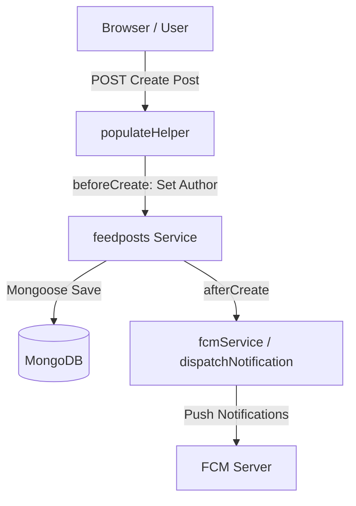
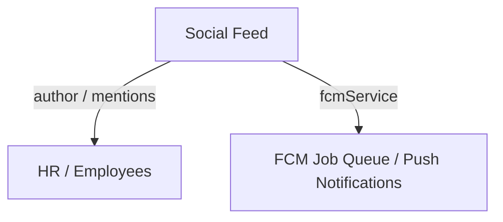

# Feed Module Brain

## Overview
The Feed module acts as the organization's social communication hub. It allows employees to post updates, ask questions, write announcements, make comments/replies, react, and categorize discussions into custom groups and channels. It contains 4 models, 4 services, and corresponding frontend views.

---

## 🏗️ Architecture & Component Relations
The feed enables dynamic visibility scopes, ensuring posts in private groups or channels are only visible to their registered members. It also triggers real-time and push notifications upon mentions, posts, or comment replies.

---

## 🗄️ Backend Models

| Model | File | Description | Key Fields | Relationships |
| :--- | :--- | :--- | :--- | :--- |
| **FeedPost** | `FeedPost.js` | Holds individual feed entries, author metadata, reactions, and statistics. | `author`, `postType`, `content`, `group`, `channel`, `mentions`, `commentsCount` | Ref: `employees`, `feedgroups`, `feedchannels` |
| **FeedComment** | `FeedComment.js` | Comments and replies on posts, supports rich text, reactions, and nesting. | `postId`, `author`, `content`, `replies` | Ref: `feedposts`, `employees` |
| **FeedGroup** | `FeedGroup.js` | Dedicated discussion groups for employees. | `name`, `members`, `createdBy` | Ref: `employees` |
| **FeedChannel** | `FeedChannel.js` | Categorized discussion channels linked to groups. | `name`, `groups`, `members`, `createdBy` | Ref: `feedgroups`, `employees` |

---

## ⚙️ Backend Services (Business Logic Hooks)

### 1. `feedposts.js`
- **beforeCreate**:
  - Automatically sets the logged-in user as the `author`.
  - Initializes `commentsCount`, `viewsCount`, `viewedBy`, and `reactions` to empty arrays or zero.
- **afterCreate**:
  - **Notify Mentions**: Checks if any employees are tagged in `mentions` and issues a `mention` notification.
  - **Notify Group/Channel**: If the post is created inside a group or channel, resolves all member employee IDs (recursively resolving associated group members for channels) and dispatches a post-broadcast notification via FCM.
- **afterUpdate**:
  - **Reaction Alerts**: Checks if a reaction was added to the post. If true, dispatches a `New Reaction` notification to the post author (if the reactor is not the author).
- **beforeRead**:
  - **Visibility Gate**: Scopes feed queries dynamically based on permissions:
    - A user can only see posts where they are the author, are mentioned, general posts (where group and channel are null), or posts published inside groups or channels they belong to.
- **beforeUpdate**:
  - Blocks client-side modifications of the `commentsCount` field.

### 2. `feedcomments.js`
- **afterCreate**:
  - Increments the `commentsCount` counter on the parent `feedposts` document.
  - Broadcasts comment notifications to the post author and post followers (excluding the commenter themselves).
- **afterDelete**:
  - Decrements the `commentsCount` counter on the parent `feedposts` document.

### 3. `feedgroups.js`
- Handles membership validation and permission checks during group creation.

### 4. `feedchannels.js`
- Validates that associated groups exist and members are active employees.

---

## 📈 Traceability Matrix (Cross-Module Map)
The Feed module integrates with:

---

## 🔗 Route & API Reference
Requests are routed dynamically via [populateHelper.js](file:///E:/Loigmax/Tracker/backend/src/helper/populateHelper.js):

| Action | HTTP Method | Route URL | Target Model | Payload Example |
| :--- | :--- | :--- | :--- | :--- |
| **View Feed** | POST | `/populate/read/feedposts` | `feedposts` | `{ page: 1, limit: 10 }` (Triggers dynamic visibility filter) |
| **Create Post** | POST | `/populate/create/feedposts` | `feedposts` | `{ postType: "General", content: "Post text", group: "grp_id" }` |
| **Add Comment** | POST | `/populate/create/feedcomments` | `feedcomments` | `{ postId: "post_id", content: "Comment text" }` |
| **React to Post** | PUT | `/populate/update/feedposts/:id` | `feedposts` | `{ $push: { reactions: { employee: "emp_id", reactionType: "like" } } }` |
