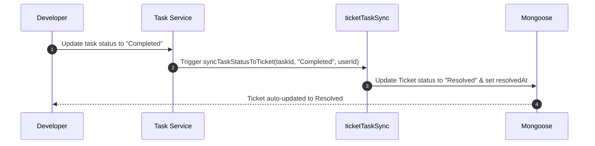

# Tickets Module Brain

## Overview
The Tickets module manages support ticketing workflows, allowing client-facing agents (via the mobile app or web endpoints) and internal employees to file issues, assign developers, exchange public and private comments, attach documents, track status history, and sync issues with development tasks. It contains 8 models and 4 services.

---

## 🏗️ Architecture & Component Relations
The module relies on the central dynamic `populateHelper` for all CRUD actions and triggers lifecycle events such as auto-participants generation, auto-comment read mapping, and developer task status synchronization.

### Sequence Flow: Task Status Sync to Ticket status

---

## 🗄️ Backend Models

| Model | File | Description | Key Fields | Relationships |
| :--- | :--- | :--- | :--- | :--- |
| **Ticket** | `Ticket.js` | Main support ticket register. | `ticketId`, `priority`, `status`, `metaStatus`, `linkedTaskId` | Ref: `projecttypes`, `products`, `tasktypes`, `clients`, `employees`, `departments`, `tasks`, `milestones` |
| **TicketComment** | `TicketComment.js` | Comments and internal developer notes attached to tickets. | `ticketId`, `commentedBy`, `commenterModel`, `isPublic`, `message` | Ref: `tickets`, `employees`, `agents`, `ticket_attachments` |
| **TicketCommentRead** | `TicketCommentRead.js` | Tracking logs of comments read by watchers. | `commentId`, `userId`, `userModel`, `readAt` | Ref: `ticket_comments`, `employees`, `agents` |
| **TicketAttachment** | `TicketAttachment.js` | Multer-uploaded file attachments for tickets. | `filename`, `originalName`, `mimetype`, `size`, `uploadedBy` | Ref: `tickets`, `employees`, `agents` |
| **TicketActivityLog** | `TicketActivityLog.js` | History of modifications and admin actions on the ticket. | `ticketId`, `action`, `performedBy`, `details` | Ref: `tickets`, `employees`, `agents` |
| **TicketAssignment** | `TicketAssignment.js` | Assignment logs of developers allocated to the ticket. | `ticketId`, `assignedTo`, `assignedBy`, `assignedByModel` | Ref: `tickets`, `employees`, `agents` |
| **TicketParticipant** | `TicketParticipant.js` | Watchers, assignees, and creators subscribed to notifications. | `ticketId`, `userId`, `userModel`, `role` | Ref: `tickets`, `employees`, `agents` |
| **TicketStatusHistory** | `TicketStatusHistory.js` | Time logs of status transitions. | `ticketId`, `fromStatus`, `toStatus`, `changedBy` | Ref: `tickets`, `employees`, `agents` |

---

## ⚙️ Backend Services (Business Logic Hooks)

### 1. `tickets.js`
- **beforeCreate**:
  - Resolves default `type` if not provided.
  - Automatically loads default `status` ("Open") and `metaStatus` ("active") from the `statusconfigs` seed.
  - If created by a client Agent, populates `clientId` and maps creator credentials.
  - Normalizes frontend model mappings (`clientName` ➔ `clientId`, `product` ➔ `productId`, etc.).
- **afterCreate**:
  - Automatically adds the creator as a participant with the `creator` role.
  - Enrolls and records ticket assignees in `ticket_participants` and `ticket_assignments`.
  - Creates the initial audit log activity records.

### 2. `ticket_comments.js`
- **beforeCreate**:
  - Maps commenter properties. Client agents are restricted to public comments only (`isPublic = true`).
  - Enforces client isolation (agents can only comment on tickets belonging to their client company).
- **afterCreate**:
  - Automatically registers the commenter as a watcher in `ticket_participants` (if not already present).
  - Automatically writes a self-read record in `ticket_comment_reads`.
  - Adjusts ticket status dynamically based on commenter tier:
    - If a client agent comments ➔ updates status to `Waiting For Admin`.
    - If an internal employee comments publicly ➔ updates status to `Waiting For Client`.
    - Registers status transition history and emits a real-time event via `ticketSocketEmitter`.

### 3. `ticket_attachments.js`
- **beforeCreate**: Extracts the Multer metadata and binds the uploader's ObjectId and model (`employees` vs `agents`).
- **afterCreate**: Updates the parent ticket's `updatedAt` timestamp and writes a log entry to `ticket_activity_logs`.

### 4. `ticketTaskSync.js`
- `syncTaskStatusToTicket`: Maps Developer task states back to the customer ticket:
  - `Backlogs` / `To Do` ➔ `Open`
  - `In Progress` / `In Review` / `Rejected` ➔ `In Progress`
  - `Approved` / `Completed` ➔ `Resolved` (marks `resolvedAt`)
  - `Closed` ➔ `Closed` (marks `closedAt`)
- `syncTaskAssignmentToTicket`: Propagates developer assignment changes back to the ticket, adding an internal thread log.
- `getSyncStatus`: Checks link validity and synchronization status between the task and ticket.
