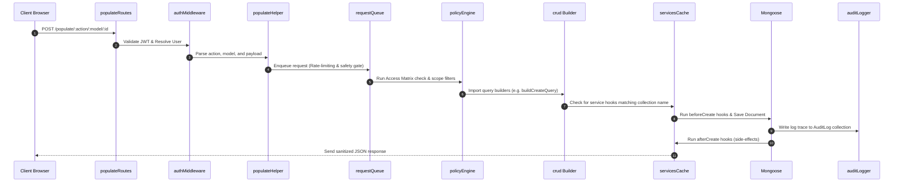

# Tracker Platform Master Architecture Guide

This document serves as the master blueprint for the Tracker Enterprise Platform's core runtime environment. It details the runtime lifecycle, security controls, and dynamic database layers that govern transaction execution.

---

## 1. Platform Philosophy & Design System Status Taxonomy

### Business Vision & System Philosophy
Tracker is designed as a metadata-driven enterprise management platform. The fundamental architectural goal is to decouple database schema definitions and authorization policies from runtime logic. Instead of building module-specific controllers and custom routes, Tracker handles the vast majority of operations through a single dynamic entry gate.

To ensure maintainability, all platform capabilities, workflows, and modules are classified using one of the following architectural states.

### Status Taxonomy Matrix
- `IMPLEMENTED`: Exists in the production codebase, verified by direct AST analysis and Graphify relationship mappings. Examples: Populate Engine, Policy Engine, Attendance computations, Asset allocations.
- `IMPLEMENTED WITH LIMITATIONS`: Implemented and fully operational for the current scope, but intentionally simplified to support rapid rollout. Future iterations represent an evolutionary path. Example: Statutory payroll calculations.
- `ARCHITECTURAL RECOMMENDATION`: Recommended improvements designed to optimize the platform, enforce compliance, or reduce future refactoring. Examples: Historical versioning constraints, automated reference locking.
- `PLANNED`: Explicitly scheduled on the product vision roadmap (e.g. AI-driven work insights).
- `FUTURE EXTENSION`: Strategic concepts that are architecturally compatible but reside outside the current roadmap.
- `UNKNOWN` or `REQUIRES PRODUCT DECISION`: Indicates areas where requirements are unverified or need product-level definition rather than engineering assumptions.

---

## 2. Populate Engine: The Dynamic CRUD Runtime

The Populate Engine is the central operational pipeline of the Tracker backend. Instead of executing direct database saves inside Express routers, all read, write, update, delete, and aggregation requests route through the Dynamic Populate Endpoint.

### Runtime Architecture Flow


### Collection Classification Guide
To keep the codebase lean, service files are only created when business validation cannot be represented by configuration or metadata. Models are categorized into one of six patterns:

```
[Mongoose Schema] ──> Category Classification ──> Execution Rules
                        ├── Configuration ──> Generic CRUD (No service)
                        ├── Registry      ──> Generic CRUD (Optional delete locks)
                        ├── Operational   ──> Service Hooks + Concurrency Gates
                        ├── Financial     ──> Service Hooks + Revision Versioning + Approval Locks
                        ├── Historical    ──> Service Hooks + History Logging + Approved Month Locks
                        └── Workflow      ──> Service Hooks + approvalEngine Workflows
```

1. **Configuration**: Layout setups, UI menus, and platform settings. Uses Generic CRUD. Services are not required.
2. **Registry**: Masters and lookup index directories. Uses Generic CRUD. Custom services are optional and restricted to checking references before a deletion.
3. **Operational**: Transaction records representing live actions. Requires service hooks for data mutations, notifications, and concurrency gates.
4. **Financial**: Accounting, calculations, and revisions. Requires service hooks, versioning tracking (effective dates), and immutability locking upon approval.
5. **Historical**: Time logs, ledger entries, and audit trails. Requires service hooks, sequential validation, and strict locking once past payroll months are approved.
6. **Workflow**: State machines moving through defined statuses. Requires services to route changes, track approval history, and sync state changes across linked modules.

---

## 3. Policy Engine & Access Matrix Security

Tracker implements a multi-layer security architecture combining Role-Based (RBAC) and Fine-Grained/Field-Based Access Control (FBAC).

### Authorization Architecture
1. **Policy Matrix**: All security configurations are stored in the declarative registry file `AccessPolicies.json`.
2. **Dynamic Constraints**: The [policyEngine.js](file:///E:/Loigmax/Tracker/backend/src/utils/policy/policyEngine.js) reads the registry policy, checks if the logged-in user's role has permission for the action, and applies the allowed fields mask.
3. **Context Executors**: If the policy contains custom conditions, it delegates validation to context-aware policy executors located in `backend/src/utils/policy/registry/`:
   - `isSelf.js`: Ensures employees can only read/edit their own profile records.
   - `isManager.js`: Validates department manager relationships before approving leaves.
   - `isAssigned.js`: Restricts update actions to the developer assigned to the task.

---

## 4. Service Hook Runtime Resolution

### Dynamic Service Resolution Rules
- The dynamic loader [servicesCache.js](file:///E:/Loigmax/Tracker/backend/src/utils/servicesCache.js) maps the lowercase, pluralized model name (e.g. `employees`) to its corresponding service file (e.g. `employees.js`).
- If the service file does not exist, the Populate Engine falls back to standard CRUD operations.
- **Hook Extension Pattern**: Pluggable business services **must extend** the CRUD engine by exporting hook functions rather than calling database write actions. They should return the updated data payload to the builder to preserve the transaction lifecycle.
- **Lifecycle Hook Points**:
  - `beforeCreate` / `afterCreate`
  - `beforeUpdate` / `afterUpdate`
  - `beforeDelete` / `afterDelete`
  - `beforeRead` / `afterRead`

---

## 5. Technology Stack & Integration Wiring

### Frontend-to-Backend Integration
The frontend React application communicates with the backend solely via the dynamic client library:
- **API Client**: [axiosInstance.js](file:///E:/Loigmax/Tracker/frontend/src/api/axiosInstance.js) wraps Axios, injecting JWT headers, handling token refreshes, and managing CSRF policies.
- **Dynamic Hook**: The generic API caller formats the payloads and posts them directly to the backend `/populate` route.

### Frontend Page Building Blocks
To simplify frontend code, lookups and admin master forms are constructed using the dynamic UI Page Builders:
- **Module Builder**: `buildSimpleModule` compiles page metadata, fields, and form controls.
- **Dynamic List**: `createListPage` renders tables with sorting, filtering, and pagination support.
- **Dynamic Form**: `createFormPage` maps schema fields to responsive UI input elements.

### Core Technology Components
1. **Core Runtime**: Node.js & Express.js
2. **Database & ODM**: MongoDB with Mongoose
3. **Frontend**: React.js with Vite
4. **Mobile**: React Native with Expo & AsyncStorage
5. **Real-time Synchronization**: Socket.io
6. **Auditing & Logging**: Centralized AuditLog collection with ApiHitLog middleware.
